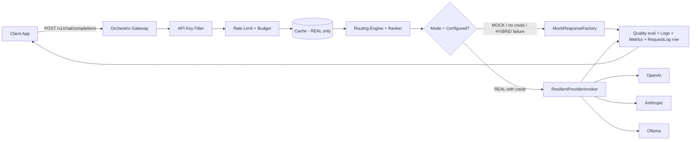
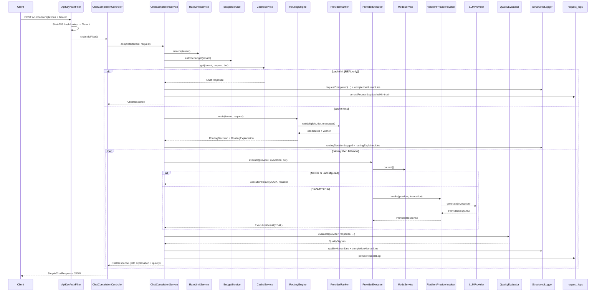
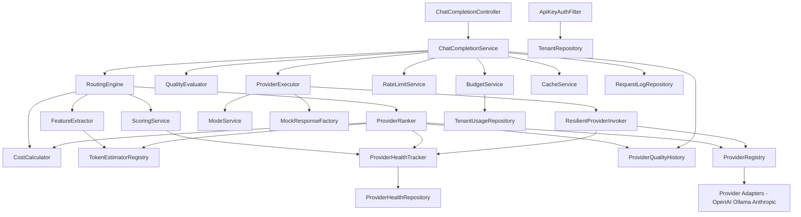
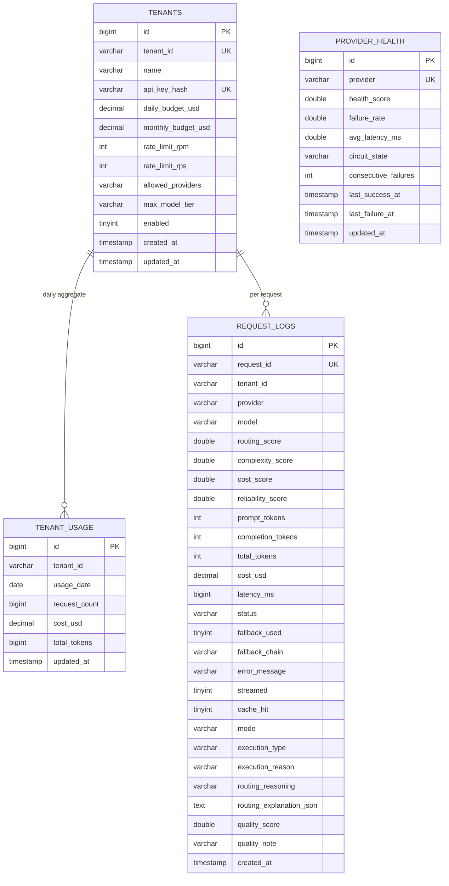
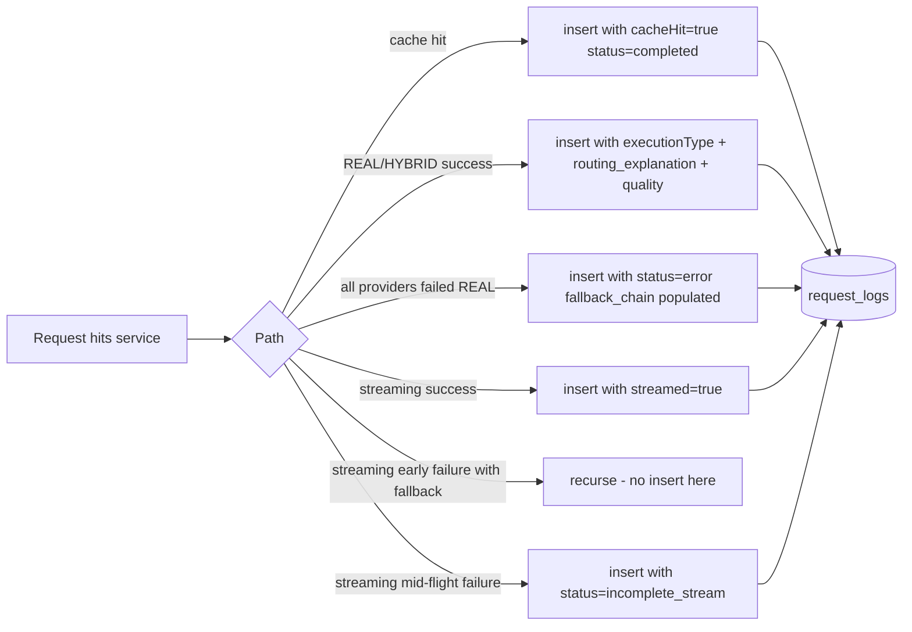
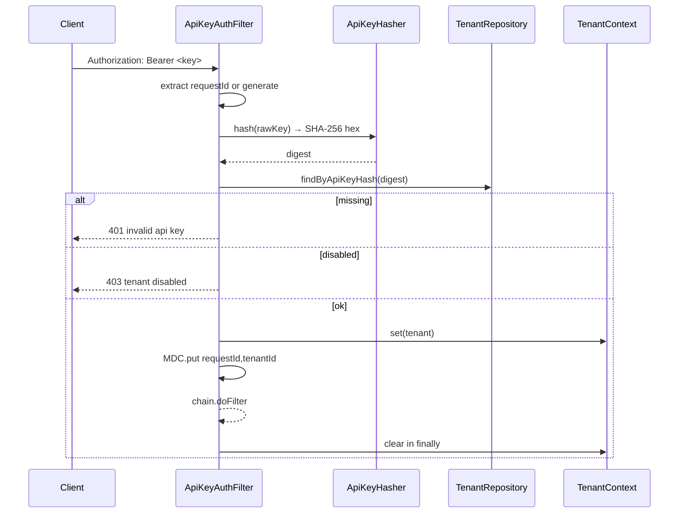
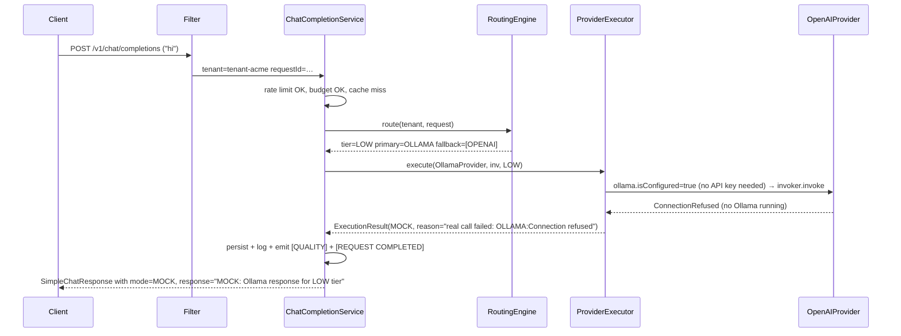

# Orchestrix — Engineering Handover Documentation


This document is the engineering handover for Orchestrix. It is structured to bring a new team to operational competence, covers every layer of the system, references real classes by name, and is honest about partial implementations and limitations. Sections 1–18 follow the requested table of contents in order.

---

## 1. Project Overview

### 1.1 What Orchestrix is

Orchestrix is a **multi-tenant intelligent LLM gateway**. It sits between a customer application and several upstream LLM providers (OpenAI, Ollama, Anthropic) and decides — per request, per tenant — which provider/model serves the request. It absorbs upstream failures with retries, circuit breakers, and a fallback chain, enforces per-tenant rate limits and budgets, and surfaces a single observable API surface across all providers.

### 1.2 Business problem solved

Teams running multiple LLM-backed features end up wanting all of these:

- Per-feature cost ceilings.
- Per-customer rate limits and quotas.
- Resilience to a single provider outage.
- Right-sized model selection (don't pay GPT-4 prices for "what's 2+2").
- A single observability surface across all providers.
- The ability to add or swap providers without changing client code.
- A safe demo/test path that doesn't burn API budget.

Doing each as one-off code on the application side leads to drift and inconsistent failure handling. Orchestrix is the shared seam: clients send a generic chat request, the gateway picks the best provider/model, executes it in the active mode (real or mock), and is honest about cost, latency, and failures.

### 1.3 Key features

| Capability                     | How it shows up                                                       |
|--------------------------------|------------------------------------------------------------------------|
| Unified API                    | `POST /v1/chat/completions` (non-streaming + SSE streaming)           |
| Per-tenant API key auth        | `Authorization: Bearer <api_key>`                                      |
| Adaptive routing               | Complexity + cost + reliability scoring with explicit reasoning        |
| Weighted provider ranking      | Per-candidate cost / latency / health / quality scoring               |
| Fallback chain                 | OpenAI → Anthropic → Ollama (configurable)                            |
| Circuit breakers + retries     | Resilience4j, per provider, with exponential backoff                  |
| Rate limits (RPS + RPM)        | Per-tenant token bucket                                                |
| Daily / monthly budgets        | Hard cap (HTTP 402) + "near-limit" routing override                   |
| Failure injection              | `POST /admin/providers/{name}/fail`                                    |
| Caching                        | Redis + bounded in-memory LRU; **REAL** results only                  |
| Three execution modes          | MOCK (always mock), REAL (real, mock if no creds), HYBRID (try real, mock on failure) |
| Quality evaluation             | Heuristic per-response scorer feeding the ranker                      |
| Token estimation               | Provider-aware (OpenAI / Anthropic / Ollama) heuristics                |
| Health scoring                 | p95 latency, EWMA-decayed failure rate, timeouts, stream interruptions|
| Observability                  | Structured JSON logs + `[ROUTING]/[EXECUTION]/[FALLBACK]/[QUALITY]/...` human lines + Prometheus metrics |
| Persistence                    | MySQL (Flyway-managed); H2 fallback for dev/test                       |

### 1.4 High-level workflow



### 1.5 User roles

- **Tenant** — A customer of the gateway. Identified by an API key. Has budgets, rate limits, allowed providers, and a max model tier.
- **Admin** — Today the same auth surface as tenants (any authenticated tenant can hit `/admin/*`). In production this should be tightened (see §17).

There is no concept of an "end user" beneath the tenant — the calling application is the unit of identity.

### 1.6 System objectives

1. **Safety** — Demos and tests run without API keys, without burning budget.
2. **Honesty** — Every response advertises whether it was real or mock and why.
3. **Reliability** — Single provider outages do not take down a tenant.
4. **Cost control** — Tenants cannot exceed daily caps; near-limit traffic auto-downgrades.
5. **Explainability** — Routing decisions ship with reasoning tags and a candidate score table.

---

## 2. Tech Stack

### 2.1 Backend

| Component                | Choice                              | Why / Where                                                  |
|--------------------------|-------------------------------------|--------------------------------------------------------------|
| Language                 | Java 17                             | LTS; required by Spring Boot 3.x                             |
| Framework                | Spring Boot 3.2.5                   | Servlet web stack + reactive WebClient hybrid                |
| Build                    | Maven 3.9+                          | `pom.xml` parent: `spring-boot-starter-parent`               |
| Web                      | `spring-boot-starter-web`           | Servlet controllers + servlet filter for auth                |
| Reactive                 | `spring-boot-starter-webflux`       | `WebClient` for non-blocking provider calls + SSE flux       |
| Validation               | `spring-boot-starter-validation`    | `@Valid` on request bodies                                   |
| Persistence (ORM)        | `spring-boot-starter-data-jpa` + Hibernate 6 | JPA entities; `open-in-view: false`                  |
| Persistence (Driver)     | `mysql-connector-j` (runtime), `h2` (runtime) | MySQL prod; H2 dev/test                            |
| Migrations               | Flyway 9.22.3 + `flyway-mysql`      | `src/main/resources/db/migration/V*.sql`                     |
| Caching (optional)       | `spring-boot-starter-data-redis`    | Lazy connection; falls back to in-memory LRU                 |
| Resilience               | Resilience4j 2.2.0                  | CircuitBreaker, Retry, TimeLimiter (per-provider)            |
| Observability — actuator | `spring-boot-starter-actuator`      | `/actuator/health|info|metrics|prometheus`                   |
| Metrics                  | `micrometer-registry-prometheus`    | Counters / timers / percentiles                              |
| Logging                  | Logback + `logstash-logback-encoder` 7.4 | JSON event logs in non-dev profiles                     |
| Lombok                   | 1.18.32                             | Boilerplate reduction (annotation processor only)            |

### 2.2 Testing

| Component                    | Choice                      | Where                                            |
|------------------------------|-----------------------------|--------------------------------------------------|
| Unit / integration           | `spring-boot-starter-test` (JUnit 5, AssertJ, Mockito) | All `src/test/...`                |
| Reactive testing             | `reactor-test`              | Stream-related tests                             |

### 2.3 What is NOT in the stack (deliberate)

- **No frontend.** Orchestrix is a backend gateway. There is no UI; observability lives in Grafana via Prometheus.
- **No message broker.** All processing is synchronous within a request. Periodic flush of `provider_health` to MySQL is via Spring `@Scheduled`.
- **No object storage.**
- **No JWT / OAuth.** Authentication is API-key-based via SHA-256 lookup.

---

## 3. Complete Architecture

### 3.1 Architectural style

A **layered hexagonal-ish architecture** centered on the chat completion lifecycle:

- The **inbound port** is the Spring MVC controller layer (`/v1/*`, `/admin/*`, `/tenant/*`).
- The **domain core** is the routing engine, scoring, ranker, and orchestrator.
- The **outbound ports** are the provider adapters (`LLMProvider` implementations) plus persistence (Spring Data JPA repositories) plus observability (`StructuredLogger`, `MetricsRecorder`).
- A **mode-aware leaf** (`ProviderExecutor`) sits between the orchestrator and provider adapters; it decides per-attempt whether to call a real provider or serve a mock.

### 3.2 Request lifecycle (non-streaming)



### 3.3 Layered architecture

| Layer            | Package                              | Representative classes                                                |
|------------------|--------------------------------------|------------------------------------------------------------------------|
| API / Controller | `com.orchestrix.controller`          | `ChatCompletionController`, `AdminController`, `TenantController`, `RootController` |
| Security         | `com.orchestrix.security`            | `ApiKeyAuthFilter`, `ApiKeyHasher`, `TenantContext`                  |
| Service          | `com.orchestrix.service`             | `ChatCompletionService`, `BudgetService`, `RateLimitService`, `CacheService` |
| Mode dispatch    | `com.orchestrix.mode`                | `ModeService`, `ProviderExecutor`, `MockResponseFactory`, `ExecutionMode/Type/Result` |
| Routing          | `com.orchestrix.routing`             | `RoutingEngine`, `ScoringService`, `FeatureExtractor`, `CostCalculator`, `ProviderRanker`, `ProviderCandidate`, `RoutingExplanation` |
| Provider adapter | `com.orchestrix.provider.*`          | `LLMProvider`, `AbstractLLMProvider`, `OpenAIProvider`, `OllamaProvider`, `AnthropicProvider`, `ProviderRegistry`, `ProviderHealthTracker`, `FailureInjectionRegistry` |
| Resilience       | `com.orchestrix.resilience`          | `ResilientProviderInvoker`                                            |
| Tokenizer        | `com.orchestrix.tokenizer`           | `TokenEstimator`, per-provider impls, `TokenEstimatorRegistry`         |
| Quality          | `com.orchestrix.quality`             | `QualityEvaluator`, `HeuristicQualityEvaluator`, `QualitySignals`, `ProviderQualityHistory` |
| Persistence      | `com.orchestrix.domain`              | `Tenant`, `RequestLog`, `ProviderHealthEntity`, `TenantUsage` + repositories |
| Observability    | `com.orchestrix.observability`       | `StructuredLogger`, `MetricsRecorder`                                |
| Config           | `com.orchestrix.config`              | `OrchestrixProperties`, `WebConfig`, `WebClientConfig`, `Resilience4jConfig`, `PropertiesConfig` |
| Bootstrap        | `com.orchestrix.bootstrap`           | `TenantBootstrap` (dev/test profile)                                  |
| Exception        | `com.orchestrix.exception`           | `OrchestrixException` + 5 typed subclasses + `GlobalExceptionHandler` |

### 3.4 Component dependency graph



### 3.5 Streaming variant

Streaming follows the same lifecycle through routing. The execution leg returns a `Flux<StreamExecution>` — chunks tagged with `executionType` and optional `reason`. `ChatCompletionService.streamWithFallback`:

- Accumulates chunks for final logging / persistence.
- Tracks `emittedChunks`. If the upstream errors **before any chunk has been emitted**, it advances to the next provider in the fallback chain.
- If chunks have already been emitted and the upstream errors, the stream ends as `incomplete_stream` — **no mock splice** even in HYBRID mode (this would corrupt client output).

### 3.6 Error propagation

Custom exceptions extend `OrchestrixException` with explicit `httpStatus()`. `GlobalExceptionHandler` maps:

- `AuthenticationException` → 401
- `BudgetExceededException` → 402
- `RateLimitExceededException` → 429
- `ProviderException` → 502
- `NoProviderAvailableException` → 503
- Validation failures → 400 with first field error
- Anything else → 500 (logged with stack trace)

### 3.7 Caching behavior

- `CacheService` keys on `tenantId | tier | sha256(messages)`.
- Streams are never cached.
- **Only `executionType == REAL` results are cached** — flipping MOCK→REAL doesn't keep serving stale mocks.
- TTL: 600 s (configurable). Backends: Redis (when `orchestrix.cache.redis-enabled=true`) or bounded in-memory LRU (5,000 entries) otherwise.

### 3.8 Retry / fallback logic

- **Retry (intra-provider):** Resilience4j retries up to 3 attempts (`orchestrix.resilience.max-retries`) with exponential backoff (`retry-base-backoff-ms`). Only `ProviderException.retryable` errors qualify.
- **Circuit breaker (per provider):** Sliding window 20 calls, failure threshold 50%, OPEN cooldown 20 s, HALF_OPEN trial 3 calls.
- **Fallback chain (cross-provider):** Configured in `orchestrix.fallback-chain`. Filtered by tenant's `allowed_providers` ∩ providers whose breaker is not OPEN.
- **HYBRID short-circuit:** A real call failure in HYBRID resolves to a mock response for the same provider — the chain is NOT advanced.

---

## 4. Folder Structure

### 4.1 Top-level

```
Orchestrix/
├── pom.xml
├── README.md
├── DESIGN.md
├── SYSTEM_DEEP_DIVE.md
├── API_TEST_REPORT.md
├── UPGRADE_NOTES.md
├── DOCUMENTATION.md          (this file)
├── src/
│   ├── main/
│   │   ├── java/com/orchestrix/
│   │   └── resources/
│   │       ├── application.yml
│   │       ├── logback-spring.xml
│   │       └── db/migration/V1__init.sql, V2, V3
│   └── test/java/com/orchestrix/
└── target/                   (Maven build output)
```

### 4.2 Java packages

```
com.orchestrix
├── OrchestrixApplication           # Spring Boot entrypoint
├── bootstrap                       # Demo tenant seeder (dev/test)
├── config                          # Spring config beans + @ConfigurationProperties
├── controller                      # HTTP entrypoints
├── domain
│   ├── entity                      # JPA entities
│   ├── model                       # Value objects + DTOs (immutable where possible)
│   └── repository                  # Spring Data JPA interfaces
├── exception                       # Typed exceptions + global handler
├── mode                            # ExecutionMode dispatcher (MOCK/REAL/HYBRID)
├── observability                   # StructuredLogger + MetricsRecorder
├── provider                        # LLMProvider contract + adapters
│   ├── openai
│   ├── ollama
│   └── anthropic
├── quality                         # Response quality evaluation
├── resilience                      # ResilientProviderInvoker
├── routing                         # Routing engine + scoring + ranker
├── security                        # API key filter + tenant context
├── service                         # High-level services (orchestrator, budget, rate limit, cache)
└── tokenizer                       # Provider-aware token estimation
```

### 4.3 Resources

| Folder                         | Purpose                                                                |
|--------------------------------|------------------------------------------------------------------------|
| `application.yml`              | Three documents (`default`, `dev`, `test`) — full property tree below |
| `logback-spring.xml`           | Logback config: HUMAN_CONSOLE for dev/test, JSON_CONSOLE elsewhere    |
| `db/migration/V1__init.sql`    | Initial schema: `tenants`, `request_logs`, `provider_health`, `tenant_usage` + seed `provider_health` rows |
| `db/migration/V2__execution_mode.sql` | Adds `mode`, `execution_type`, `execution_reason` columns to `request_logs` |
| `db/migration/V3__routing_explanation_and_quality.sql` | Adds `routing_reasoning`, `routing_explanation_json`, `quality_score`, `quality_note` columns to `request_logs` |

### 4.4 Test structure

```
src/test/java/com/orchestrix
├── integration                     # Spring Boot @SpringBootTest with TestProviders
│   ├── ChatApiIntegrationTest      # Auth + chat + tenant isolation
│   ├── ModeSwitchIntegrationTest   # /admin/mode/switch end-to-end
│   └── AdminApiIntegrationTest     # /admin/* + /tenant/* surface
├── mode                            # ProviderExecutor unit tests (mode dispatch)
├── provider                        # ProviderHealthTracker behaviour
├── quality                         # HeuristicQualityEvaluator + history decay
├── routing                         # FeatureExtractor, RoutingEngine, ProviderRanker, RoutingExplanation
├── scenarios                       # ScenarioMatrixTest — modes × conditions
├── service                         # ChatCompletionFallbackTest, RateLimitServiceTest
├── tokenizer                       # TokenEstimatorTest
└── support                         # Test doubles: TestLLMProvider, ConfigurableTestProvider, NoopCacheService, NullObjectProvider, Wiring
```

---

## 5. Class-by-class Documentation

This section walks every class. Files are grouped by package.

### 5.1 Entrypoint

#### `com.orchestrix.OrchestrixApplication`
- **Purpose:** Spring Boot entrypoint.
- **Annotations:** `@SpringBootApplication`, `@EnableAsync`, `@EnableScheduling`.
- **Why scheduling is enabled:** `ProviderHealthTracker.flushToDatabase()` is annotated `@Scheduled(fixedDelay=30s)`.
- **Why async is enabled:** Future-ready hook; no `@Async` methods are used in the current code.

### 5.2 Bootstrap

#### `bootstrap.TenantBootstrap` (CommandLineRunner, `@Profile({"dev","test"})`)
- **Purpose:** Seed two demo tenants on first boot so the gateway is usable without manual SQL.
- **Demo keys (dev only):** `tenant-acme` → `orx_acme_demo_key_123`; `tenant-globex` → `orx_globex_demo_key_456`.
- **Idempotent:** Looks up by `tenantId` before inserting.
- **Calls into:** `TenantRepository`, `ApiKeyHasher`.
- **Security note:** Never runs in non-dev/test profiles.

### 5.3 Config

#### `config.OrchestrixProperties`
- **Annotations:** `@Getter @Setter @ConfigurationProperties(prefix = "orchestrix")`.
- **Top-level fields:** `mode` (default HYBRID), `Cache cache`, `Routing routing`, `Resilience resilience`, `Map<String,Provider> providers`, `List<ProviderType> fallbackChain`, `FailureInjection failureInjection`.
- **Nested types:** `Cache`, `Routing` (with `CandidateWeights`), `Resilience`, `Provider`, `FailureInjection`.
- **Loaded by:** `PropertiesConfig` via `@EnableConfigurationProperties`.
- **Cross-references:** Read by every other module (routing, ranker, provider adapters, cache, rate limit, etc.).

#### `config.PropertiesConfig`
- One-liner `@Configuration` that does `@EnableConfigurationProperties(OrchestrixProperties.class)`.

#### `config.WebClientConfig`
- **Bean:** `providerWebClientBuilder` — a shared `WebClient.Builder` with Netty connect (5 s), read, and write timeouts pulled from `orchestrix.resilience.request-timeout-ms`.
- **Used by:** `OpenAIProvider`, `OllamaProvider`, `AnthropicProvider` (qualified via `@Qualifier("providerWebClientBuilder")`).

#### `config.WebConfig`
- Registers `ApiKeyAuthFilter` against URL patterns `/v1/*`, `/admin/*`, `/tenant/*` with order `Ordered.HIGHEST_PRECEDENCE + 50`.

#### `config.Resilience4jConfig`
- **CircuitBreakerRegistry:** sliding window 20 calls, min calls 10, failure rate 50%, open cooldown 20 s, HALF_OPEN trial 3 calls, automatic OPEN→HALF_OPEN.
- **RetryRegistry:** retries up to `orchestrix.resilience.max-retries` (default 3), with `retry-base-backoff-ms` interval, retrying only `ProviderException.retryable=true`.
- **Pre-registers:** breakers `provider-openai`, `provider-ollama`, `provider-anthropic` so the health endpoint reports honestly from boot.

### 5.4 Security

#### `security.ApiKeyHasher`
- One method: `String hash(String rawKey)` → SHA-256 hex string.
- Used by the filter (auth lookup) and `TenantBootstrap` (seeding).

#### `security.TenantContext`
- ThreadLocal holder for the authenticated `Tenant`. Set by the filter, cleared in its `finally`. Read by controllers and services.
- `require()` throws `IllegalStateException` if unset — defensive against route-misconfigured paths.

#### `security.ApiKeyAuthFilter` (`OncePerRequestFilter`)
- **Authenticates:** `Authorization: Bearer <key>` (also accepts `X-Orchestrix-Api-Key` for curl convenience).
- **Workflow:**
  1. Sets / generates `requestId` (also exposed in response header `X-Request-Id`).
  2. Pushes `requestId`, `tenantId` into MDC.
  3. Hashes the bearer token; looks up `Tenant` by hash.
  4. Returns 401 / 403 for missing / invalid / disabled tenants.
  5. Sets `TenantContext`, calls `chain.doFilter`, then clears all in `finally`.
  6. Emits `[AUTH] requestId=… tenant=… authenticated`.
- **`shouldNotFilter`:** `/actuator`, `/`, `/error` are skipped.

### 5.5 Domain — entities

#### `domain.entity.Tenant`
- Columns: `tenant_id`, `name`, `api_key_hash`, `daily_budget_usd`, `monthly_budget_usd`, `rate_limit_rpm`, `rate_limit_rps`, `allowed_providers` (CSV), `max_model_tier`, `enabled`, `created_at`, `updated_at`.
- Helper: `getAllowedProviders()` parses the CSV.
- Lifecycle hooks `@PrePersist`/`@PreUpdate` maintain timestamps.

#### `domain.entity.RequestLog`
- One row per **completed** (success or terminal failure) request.
- Columns: routing scores, prompt/completion/total tokens, `cost_usd`, `latency_ms`, `status`, `fallback_used`, `fallback_chain`, `error_message`, `streamed`, `cache_hit`, `mode`, `execution_type`, `execution_reason`, `routing_reasoning`, `routing_explanation_json`, `quality_score`, `quality_note`, `created_at`.
- Constraint: unique on `request_id` — protects against duplicate persistence.

#### `domain.entity.ProviderHealthEntity`
- Last-flushed snapshot of per-provider health: `health_score`, `failure_rate`, `avg_latency_ms`, `circuit_state`, `consecutive_failures`, `last_success_at`, `last_failure_at`.
- Updated by `ProviderHealthTracker.flushToDatabase()` every 30 s.

#### `domain.entity.TenantUsage`
- Daily aggregate: `tenant_id`, `usage_date`, `request_count`, `cost_usd`, `total_tokens`.
- Unique on `(tenant_id, usage_date)`.
- Updated synchronously by `BudgetService.recordSpend`.

### 5.6 Domain — repositories

| Interface                  | Methods (notable)                                                            |
|----------------------------|------------------------------------------------------------------------------|
| `TenantRepository`         | `findByApiKeyHash`, `findByTenantId`                                         |
| `RequestLogRepository`     | `findTop50ByTenantIdOrderByCreatedAtDesc`, `countByTenantIdAndCreatedAtAfter` |
| `ProviderHealthRepository` | `findByProvider`                                                             |
| `TenantUsageRepository`    | `findByTenantIdAndUsageDate`, `findByTenantIdAndUsageDateBetween`             |

### 5.7 Domain — value models

| Class                | Role                                                                                |
|----------------------|--------------------------------------------------------------------------------------|
| `ProviderType`       | Enum `OPENAI | ANTHROPIC | OLLAMA` + `from(String)`.                                |
| `ModelTier`          | Enum `LOW | MID | HIGH` + `atMost(other)`.                                          |
| `ChatMessage`        | `role`, `content` — validated.                                                      |
| `ChatRequest`        | `messages` (validated), `stream`, `maxTokens`, `temperature`, `preferredTier`.       |
| `ChatResponse`       | Internal rich response: content, tokens, cost, latency, fallback info, mode, executionType, executionReason, routing explanation, quality. |
| `SimpleChatResponse` | Demo-friendly DTO returned by the controller — derives from `ChatResponse.from()`.  |
| `PromptFeatures`     | Output of `FeatureExtractor` — token estimate, char count, `hasCode`, `isArchitecture`, `isDebugging`, `lengthFactor`. |
| `ProviderInvocation` | Adapter call envelope: requestId, tenantId, provider, model, messages, maxTokens, temperature. |
| `ProviderResponse`   | Non-streaming provider output.                                                       |
| `ProviderStreamChunk`| Streaming provider output.                                                           |
| `RoutingDecision`    | `primaryProvider`, `primaryModel`, `selectedTier`, `fallbackProviders`, all sub-scores, `overrideApplied`, `overrideReason`, `RoutingExplanation`. |

### 5.8 Routing

#### `routing.FeatureExtractor`
- Reads chat messages and emits `PromptFeatures`.
- Heuristics: regex for code blocks (`code`, `def`, `class`, `function`, `=>`), architecture keywords (`distributed`, `kafka`, `cqrs`, `sharding`, …), debugging keywords (`debug`, `stack trace`, `exception`, …).
- Token estimate: prefers `TokenEstimatorRegistry.neutralEstimate` if injected; falls back to `chars/4`.
- Backward-compat: parameterless constructor preserved for older tests.

#### `routing.CostCalculator`
- `estimatedCostUsd(provider, prompt, completion)` — looks up `costPer1kInputTokens` / `costPer1kOutputTokens` from `OrchestrixProperties`.
- `exactCostUsd(...)` — same value as `BigDecimal(scale=6, HALF_UP)` for budget recording.

#### `routing.ScoringService`
- Implements the documented complexity / cost / reliability formula:
  - `complexityScore(features)` — normalized tokens + code(2) + arch(3) + debug(2) + lengthFactor.
  - `costScore(provider, tokens)` — raw USD (was multiplied by 100 in early versions; now raw per spec).
  - `reliabilityScore(provider)` — `(health × 3) − latency_penalty − failure_rate_penalty`.
  - `finalScore(C, R, K)` — `0.5C + 0.3R − 0.2K`.
  - `tierFromScore(score)` — buckets via thresholds (`scoreLowTierMax`, `scoreMidTierMax`).

#### `routing.ProviderCandidate`
- Value object: `provider`, `model`, `promptTokens`, `outputTokens`, `estimatedCostUsd`, sub-scores (cost/latency/health/quality on a 0..10 scale where higher=better), `finalWeightedScore`, `excluded`, `exclusionReason`.

#### `routing.ProviderRanker`
- For each eligible provider, produces a `ProviderCandidate` and picks the max `finalWeightedScore`.
- **Sub-scores:**
  - `costToScore(usd)` — 10 if free, 0 at $0.20+, linear in between.
  - `latencyToScore(p95Ms)` — 10 if ≤250 ms, 0 at ~5 s.
  - `healthScore(provider) × 10`.
  - `qualityHistory.average(provider)` (0..10 default prior 8.0).
- **Weighted sum:** uses `OrchestrixProperties.CandidateWeights` (cost 1.5, latency 1.0, health 2.0, quality 1.0 by default).

#### `routing.RoutingEngine`
- Top-level decision maker. Two constructors:
  - Production: with `ProviderRanker`.
  - Legacy: without ranker (falls back to "first eligible" + "LOW prefers Ollama").
- **`route(tenant, request)` pipeline:**
  1. Extract features → emit reasoning tags (`code_block_detected`, `architecture_keywords_detected`, `debugging_keywords_detected`, `estimated_prompt_tokens=N`).
  2. Build eligible providers (intersect `tenant.allowed_providers` ∩ `fallback-chain` ∩ enabled ∩ breaker not OPEN). Emit `provider_not_allowed=…`, `provider_disabled=…`, `provider_circuit_open=…` for excluded providers.
  3. Compute scalar scores against the first eligible provider as a representative candidate.
  4. Map score to tier; honor `tenant.max_model_tier`; honor near-budget (≥ 90%) and over-budget overrides — emit `override_*` reasoning tags.
  5. Run `ProviderRanker` for the applied tier; primary = winner; fallback = remaining ranked providers.
  6. Tag provider health (`provider_health_good|degraded|poor=NAME`).
  7. Build `RoutingDecision` with full `RoutingExplanation`.

#### `routing.RoutingExplanation`
- Surfaced in the API response as `routing` field, in JSON event logs, and persisted as `routing_explanation_json` on `request_logs`.
- Includes: scores, selected tier/provider/model, reasoning tags, candidate table, fallback chain, estimated tokens / cost.
- Inner `RankedProviderView` mirrors `ProviderCandidate` for serialization safety.

### 5.9 Provider adapters

#### `provider.LLMProvider` (interface)
- Contract: `type()`, `enabled()`, `isConfigured()` (default = `enabled()`), `resolveModel(tier)`, `Mono<ProviderResponse> generate(inv)`, `Flux<ProviderStreamChunk> stream(inv)`.

#### `provider.AbstractLLMProvider`
- Holds per-provider config + failure injection registry.
- `resolveModel(tier)` reads from `Provider.models` map, defaults to `mid` then first available.
- `applyFailureInjection()` consults the registry and either delays the call or throws a synthetic `ProviderException`.
- Helper `toProviderException(t)` for adapter error mapping.

#### `provider.openai.OpenAIProvider`
- **HTTP:** `POST /v1/chat/completions` with `Authorization: Bearer <key>`.
- **Streaming:** SSE; `[DONE]` terminator; finishes on `finish_reason`.
- **isConfigured:** `enabled()` && key set && key ≠ `sk-test-placeholder`.
- **Token estimation:** uses provider-reported `usage.prompt_tokens` / `usage.completion_tokens`; falls back to `chars/4`.
- **Trailing-slash safe:** strips trailing `/` from base URL before WebClient build.

#### `provider.ollama.OllamaProvider`
- **HTTP:** `POST /api/chat` (NDJSON for streaming).
- **isConfigured:** `enabled()` && base URL set (no API key required).
- **Token estimation:** `prompt_eval_count` / `eval_count` from response; `chars/4` fallback.
- **Trailing-slash safe.**

#### `provider.anthropic.AnthropicProvider`
- **HTTP:** `POST /v1/messages` with `x-api-key` and `anthropic-version: 2023-06-01`.
- Splits chat history into Anthropic's `system` + `messages` shape.
- **Streaming:** *Partially implemented* — emits a single chunk derived from non-streaming response. A full SSE event-type parser (`message_start`, `content_block_delta`, …) is documented as a known gap.
- **isConfigured:** key set.

#### `provider.ProviderRegistry`
- Built from all `LLMProvider` Spring beans at startup. EnumMap lookup. `isEnabled(type)`, `get(type) → Optional`, `all()`.

#### `provider.ProviderHealthTracker`
- Per-provider rolling stats over 200-sample window:
  - Counters: total calls, failures, timeouts, retries, stream interruptions, consecutive failures.
  - Latency window (ArrayDeque) → p95 computed on demand.
  - EWMA failure rate (`α = 0.05`) for long-tail signal.
- `healthScore(provider)`: 1.0 base − failure penalty (max 0.5) − latency penalty (p95 > 2s) − consecutive penalty (≥3 ⇒ up to 0.2) − interruption penalty (max 0.15), all multiplied by circuit-breaker factor (CLOSED=1, HALF_OPEN=0.5, OPEN=0).
- `snapshot(provider)` returns a readable `HealthSnapshot` record with all signals.
- `flushToDatabase()` runs every 30 s, writes / updates `provider_health` rows.
- **Initialization:** `@PostConstruct init()` seeds an in-memory `Stats` per provider type so first-read paths can't NPE.

#### `provider.FailureInjectionRegistry`
- In-memory map of `Rule(mode, delayMs, errorBurst)` per provider.
- Modes: `NONE | TIMEOUT | SLOW | ERROR | ALWAYS_ERROR`.
- `applyAndComputeDelay(provider)` returns delay-ms or `-1` to indicate "fail this call". The method has side effects (decrements `errorBurst` counter); callers invoke once per attempt.

### 5.10 Resilience

#### `resilience.ResilientProviderInvoker`
- Wraps every real call with: `Mono.timeout(...)` → `CircuitBreakerOperator` → `RetryOperator` (non-streaming only).
- Records to `ProviderHealthTracker`:
  - Success → `recordSuccess`
  - `TimeoutException` → `recordTimeout`
  - Other failure → `recordFailure`
  - Streaming with chunks already emitted, then error → `recordStreamInterruption`.

### 5.11 Mode dispatcher

#### `mode.ExecutionMode` (enum)
- `MOCK`, `REAL`, `HYBRID` + `parse(String, fallback)`.

#### `mode.ExecutionType` (enum)
- `MOCK`, `REAL` — the actual execution outcome (vs. the configured mode).

#### `mode.ExecutionResult` (value)
- `provider`, `model`, `response`, `executionType`, `reason`.

#### `mode.ModeService`
- `AtomicReference<ExecutionMode>` holder. Initialized from `OrchestrixProperties.mode` on startup.
- `current()` and `setMode(mode)` are atomic. Mode flip log: `orchestrix-mode switched from=… to=…`.

#### `mode.MockResponseFactory`
- Deterministic mock content: `"MOCK: <ProviderLabel> response for <TIER> tier"` with `12 prompt / 24 completion` token counts.
- Streaming: two-chunk flux (content chunk + done chunk).

#### `mode.ProviderExecutor`
- The leaf decision: real or mock? Per-attempt:
  - `MOCK` → mock immediately (`reason=mode=MOCK`).
  - `REAL` / `HYBRID` and `!provider.isConfigured()` → mock with `reason=credentials missing`.
  - `REAL` and configured → call invoker; failures bubble.
  - `HYBRID` and configured → call invoker; on error → mock for the same provider.
- **Streaming mid-flight protection:** Tracks emitted real chunks. In HYBRID, if real chunks have been emitted AND the upstream errors mid-stream, propagates the error rather than splicing mock tokens onto a partial real stream.

### 5.12 Service layer

#### `service.RateLimitService`
- Per-tenant dual `TokenBucket` (RPS + RPM) in a `ConcurrentHashMap`.
- `enforce(tenant)` consumes 1 token from each; throws `RateLimitExceededException` (HTTP 429) on exhaustion.
- `snapshot(tenantId)` returns current available tokens for both buckets.
- **Note:** In-process only; multi-replica deployments need Redis-backed sliding window (see §17).

#### `service.BudgetService`
- `enforceBudget(tenant)` reads `tenant_usage` for today, throws `BudgetExceededException` (HTTP 402) when daily spend ≥ daily budget.
- `isOverBudget` / `isNearBudgetLimit` (≥ 90%) — soft signals consumed by the routing engine.
- `recordSpend(tenant, amountUsd, tokens)` upserts the daily row. `synchronized` for single-instance accuracy.

#### `service.CacheService`
- Tenant-scoped cache, keyed on `sha256(tenantId | tier | messages)`.
- Streaming requests bypass cache; only `executionType == REAL` results are stored.
- Tries Redis (when `redis-enabled: true`); falls back to bounded in-memory LRU (`5,000` entries, `LinkedHashMap` with access ordering).
- TTL: configurable (default 600 s).

#### `service.ChatCompletionService`
- The orchestrator. Two entrypoints:
  - `Mono<ChatResponse> complete(tenant, request)`
  - `Flux<ProviderStreamChunk> stream(tenant, request)`
- **Pipeline (non-streaming):**
  1. Generate / inherit `requestId`.
  2. `RateLimitService.enforce(tenant)`.
  3. `BudgetService.enforceBudget(tenant)`.
  4. `RoutingEngine.route(tenant, request)`.
  5. Log routing decision (JSON event + `[ROUTING]` line with reasoning summary). Record routing-score metric.
  6. Cache lookup (REAL-only, non-streaming only).
  7. `tryNext(...)` walks `[primary, …fallbackProviders]`:
     - For each: build `ProviderInvocation`, call `ProviderExecutor.execute`, build `ChatResponse` with explanation + quality, record metrics + structured log + `[REQUEST COMPLETED]`, persist `RequestLog`.
     - On error: emit `[FALLBACK]` line + JSON event, recurse with `idx+1`. If chain exhausted: persist error row + throw `NoProviderAvailableException`.
- **Streaming pipeline `streamWithFallback(...)`:**
  - Same up to routing.
  - Subscribes to `providerExecutor.executeStream`. Tracks `executionType[0]`, `executionReason[0]`, accumulator + token counts.
  - On `doOnComplete`: evaluate quality, build response, record metrics, persist log.
  - On `onErrorResume`: if no chunks yet AND chain has more providers → recurse; else mark `incomplete_stream` (or `error`) and end.
- **Quality:** Calls `qualityEvaluator.evaluate(...)`, records into `qualityHistory`, emits `[QUALITY]` line.
- **Cache write:** Only on `executionType == REAL` to prevent stale-mock leakage across mode flips.

### 5.13 Tokenizer

| Class                          | Role                                                                |
|--------------------------------|---------------------------------------------------------------------|
| `TokenEstimator` (interface)   | `providerType()`, `estimateTokens(messages|text)`, `estimateOutputTokens(prompt)`. |
| `HeuristicTokenEstimator`      | Base — chars/token tunable + per-message envelope cost (4 tokens). |
| `OpenAITokenEstimator`         | 4.0 chars/token (cl100k_base approximation).                        |
| `AnthropicTokenEstimator`      | 3.5 chars/token (claude-3 tokenizer is denser).                     |
| `OllamaTokenEstimator`         | 4.2 chars/token (sentencepiece).                                    |
| `TokenEstimatorRegistry`       | Per-provider lookup with OpenAI fallback + `neutralEstimate(...)` for the routing engine. |

**Status:** *Heuristic implementations.* The interface allows plugging in `jtokkit` (or anthropic-tokenizer) without changing the routing engine.

### 5.14 Quality

| Class                          | Role                                                                |
|--------------------------------|---------------------------------------------------------------------|
| `QualityEvaluator` (interface) | `evaluate(provider, response, promptTokens, streamInterrupted)` → `QualitySignals`. |
| `HeuristicQualityEvaluator`    | 5-signal heuristic: malformed (truncation markers), completeness (tokens-bucket), length ratio, stream-interruption penalty, mock-aware floor. |
| `QualitySignals`               | `score (0..10)`, `malformed`, `completeness (low|medium|high)`, `streamInterrupted`, `lengthRatio`, `note`. |
| `ProviderQualityHistory`       | EWMA of recent quality scores per provider (`α = 0.1`, prior `8.0`). |

**Status:** Heuristic quality only. The interface is designed to accommodate an LLM-as-judge implementation later.

### 5.15 Observability

#### `observability.StructuredLogger`
- Both human-readable and structured-JSON event lines:
  - `requestCompleted(...)` — JSON event `llm.request.completed`.
  - `routingDecisionLogged(...)` — JSON event `llm.routing.decision`.
  - `fallbackUsed(...)` — JSON event `llm.fallback.used`.
  - `routingHumanLine`, `routingExplainedLine`, `executionHumanLine`, `authHumanLine`, `healthHumanLine`, `fallbackHumanLine`, `qualityHumanLine`, `completionHumanLine` — terminal-friendly story lines.
- Uses `net.logstash.logback.argument.StructuredArguments.entries(...)` for JSON serialization.

#### `observability.MetricsRecorder`
- Wraps Micrometer with consistent tags: `tenant`, `provider`, `model`, `status`, `cache`, `fallback`.
- Counters: `orchestrix.requests`, `orchestrix.tokens.total`, `orchestrix.cost.usd`, `orchestrix.cache.hits`, `orchestrix.fallback`.
- Timer with percentiles: `orchestrix.llm.latency` (p50/p95/p99).
- Routing score: `orchestrix.routing.score` keyed by tenant + tier.

### 5.16 Controllers

#### `controller.RootController` — `GET /`
- Returns `{ service, status, mode, endpoints }`. Useful smoke check.

#### `controller.ChatCompletionController` — `POST /v1/chat/completions`
- Dispatches based on `request.stream`:
  - Non-streaming → `Mono<ChatResponse>` mapped to `SimpleChatResponse` and `ResponseEntity.ok`.
  - Streaming → `Flux<ServerSentEvent<String>>` of `event: token` chunks, with a 15 s heartbeat (`event: keep-alive` comment) so proxies don't drop the connection. Errors emit a final `event: error` chunk.
- Validates `ChatRequest` via `@Valid`.

#### `controller.AdminController`
- `GET /admin/mode` — current mode + valid set.
- `POST /admin/mode/switch` — body `{"mode":"MOCK|REAL|HYBRID"}` — atomic flip.
- `GET /admin/provider/status` — per-provider snapshot: enabled, configured, circuit state, health score, latency, failure rate, `realCallPossible`.
- `POST /admin/providers/{provider}/fail` — install failure-injection rule (`mode`, `delayMs`, `burst`).
- `POST /admin/providers/{provider}/recover` — clear rule **and reset the circuit breaker**.
- `GET /admin/providers/health` — live health snapshot.
- `GET /admin/providers/health/persisted` — last-flushed `provider_health` rows.
- **Note:** Today gated by the same API key filter as tenant API. Production should role-gate (see §17).

#### `controller.TenantController`
- `GET /tenant/state` (alias `/tenant/me`) — identity, daily budget, daily spent, daily remaining, rate-limit settings, allowed providers, max model tier, `buckets` snapshot, `currentExecutionMode`.
- `GET /tenant/requests` — last 50 logs for the calling tenant.

### 5.17 Exceptions

| Class                          | HTTP   | Notes                                                       |
|--------------------------------|--------|--------------------------------------------------------------|
| `OrchestrixException` (abstract) | —    | Base; declares `httpStatus()` abstract.                       |
| `AuthenticationException`      | 401    | Used by future auth flows (filter writes 401 directly today). |
| `BudgetExceededException`      | 402    |                                                              |
| `RateLimitExceededException`   | 429    |                                                              |
| `ProviderException`            | 502    | Carries `ProviderType` + `retryable` flag.                   |
| `NoProviderAvailableException` | 503    | Thrown when chain exhausts.                                  |
| `GlobalExceptionHandler`       | —      | `@RestControllerAdvice` mapping all of the above + `MethodArgumentNotValidException` (400) + catch-all (500). Body shape `{type, message, timestamp, meta:{requestId, tenantId}}`. |

---

## 6. Database Documentation

### 6.1 ER overview



### 6.2 Table purposes & business meaning

| Table              | Purpose                                                                | Service that owns writes                  |
|--------------------|------------------------------------------------------------------------|--------------------------------------------|
| `tenants`          | Source of truth for tenant identity + policy.                          | `TenantBootstrap` (dev/test); manual SQL or future admin API in prod. |
| `request_logs`     | One row per terminal request outcome — success, failure, cache hit. Powers `/tenant/requests` and historical audits ("why was this provider picked?"). | `ChatCompletionService.persistRequestLog` (single call site, idempotent via `request_id` unique constraint). |
| `provider_health`  | Periodic snapshot of in-memory health stats. Survives restarts. Used by `/admin/providers/health/persisted`. | `ProviderHealthTracker.flushToDatabase` every 30 s (`@Transactional`). |
| `tenant_usage`     | Daily spend + token count per tenant. Drives budget enforcement.       | `BudgetService.recordSpend` (`@Transactional synchronized`). Also implicitly read by `enforceBudget` / overrides. |

### 6.3 Indexes

| Index                                | Table          | Purpose                                          |
|--------------------------------------|----------------|--------------------------------------------------|
| `uk_tenants_tenant_id`               | `tenants`      | Unique constraint on logical tenant id.          |
| `uk_tenants_api_key_hash`            | `tenants`      | Unique on hashed key — auth lookup.              |
| `uk_request_logs_request_id`         | `request_logs` | Idempotency for persist.                          |
| `idx_request_logs_tenant_created`    | `request_logs` | Powers `findTop50ByTenantIdOrderByCreatedAtDesc`. |
| `idx_request_logs_provider`          | `request_logs` | Provider-centric historical queries.             |
| `idx_request_logs_execution_type`    | `request_logs` | "How much of yesterday was MOCK?"                 |
| `idx_request_logs_quality_score`     | `request_logs` | Quality histograms.                               |
| `uk_provider_health_provider`        | `provider_health` | One row per provider.                          |
| `uk_tenant_usage_day`                | `tenant_usage` | One row per `(tenant_id, usage_date)`.            |

### 6.4 Migrations

| Version | File                                        | Adds                                                                                              |
|---------|---------------------------------------------|---------------------------------------------------------------------------------------------------|
| V1      | `V1__init.sql`                              | `tenants`, `request_logs`, `provider_health`, `tenant_usage` + seed `provider_health` rows.       |
| V2      | `V2__execution_mode.sql`                    | `request_logs.mode`, `execution_type`, `execution_reason` (one ALTER per column for H2 compat).   |
| V3      | `V3__routing_explanation_and_quality.sql`   | `request_logs.routing_reasoning`, `routing_explanation_json (TEXT)`, `quality_score`, `quality_note`. |

### 6.5 Transaction boundaries

- `BudgetService.recordSpend` and `ProviderHealthTracker.flushToDatabase` are `@Transactional`. Everything else uses Spring Data's default per-method-call transaction semantics.
- `persistRequestLog` is best-effort: catches and warn-logs on failure so a DB blip cannot break a user-facing response.

### 6.6 Lifecycle of a `request_logs` row



Each request results in **exactly one** row (or zero on chain-advance recursion). Idempotency is guaranteed by `uk_request_logs_request_id`.

---

## 7. API Documentation

All APIs require `Authorization: Bearer <api-key>` unless explicitly noted. The bearer token is the raw API key; the gateway hashes (SHA-256) and looks it up.

### 7.1 `POST /v1/chat/completions`

**Purpose:** Submit a chat completion. Orchestrix picks the provider and model.

**Auth:** Required.

**Request body** (validated):

```json
{
  "messages": [
    { "role": "user", "content": "Explain CAP theorem briefly." }
  ],
  "stream": false,
  "maxTokens": 512,
  "temperature": 0.7
}
```

| Field         | Type    | Required | Notes                                                  |
|---------------|---------|----------|--------------------------------------------------------|
| `messages`    | array   | yes      | non-empty; each element validated (role, content).      |
| `stream`      | boolean | no       | Default false. When true, response is SSE flux.         |
| `maxTokens`   | int     | no       | Forwarded to provider when supported.                   |
| `temperature` | double  | no       | Forwarded to provider when supported.                   |
| `preferredTier` | string | no      | Hint only — never overrides the routing engine.        |

**Successful non-streaming response (200):**

```json
{
  "requestId": "f751929a-…",
  "tier": "MID",
  "provider": "OPENAI",
  "model": "gpt-4o-mini",
  "mode": "MOCK",
  "response": "MOCK: OpenAI response for MID tier",
  "cost": 0,
  "latencyMs": 12,
  "fallbackUsed": false,
  "fallbackChain": "OPENAI",
  "reason": "credentials missing",
  "status": "completed",
  "qualityScore": 6.5,
  "qualityNote": "short;mock-response;",
  "routing": {
    "complexityScore": 3.085,
    "reliabilityScore": 3.0,
    "costScore": 0.0001,
    "finalScore": 2.443,
    "selectedTier": "MID",
    "selectedProvider": "OPENAI",
    "selectedModel": "gpt-4o-mini",
    "estimatedPromptTokens": 27,
    "estimatedOutputTokens": 50,
    "estimatedCostUsd": 0.0885,
    "reasoning": [
      "architecture_keywords_detected",
      "estimated_prompt_tokens=27",
      "tenant_max_tier=HIGH",
      "score_tier=MID",
      "estimated_cost_within_budget",
      "applied_tier=MID",
      "provider_chosen=OPENAI,weighted_score=42.31",
      "provider_health_good=OPENAI",
      "provider_health_good=OLLAMA"
    ],
    "candidates": [
      { "provider": "OPENAI", "finalScore": 42.31, "costScore": 5.575, "latencyScore": 10, "healthScore": 10, "qualityScore": 8, "excluded": false },
      { "provider": "OLLAMA", "finalScore": 41.0, "costScore": 10, "latencyScore": 10, "healthScore": 10, "qualityScore": 8, "excluded": false }
    ],
    "fallbackChain": ["OLLAMA"]
  }
}
```

**Successful streaming response (200, `Content-Type: text/event-stream`):**

```
event: token
data: {"delta":"CAP","done":false}

event: token
data: {"delta":" theorem says","done":false}

event: token
data: {"delta":"","done":true,"finishReason":"stop","promptTokens":12,"completionTokens":42}
```

Mid-stream errors emit a final `event: error` chunk and end the stream as `incomplete_stream` in the persisted row.

**Error responses:**

| Code | When                                                                        |
|------|------------------------------------------------------------------------------|
| 400  | `messages` empty / malformed body                                           |
| 401  | Missing or invalid bearer token                                             |
| 402  | Tenant daily budget exhausted                                               |
| 403  | Tenant disabled                                                             |
| 429  | Rate limit (RPS or RPM) exceeded                                            |
| 502  | Upstream provider error (after retries) — only in REAL when chain exhausts  |
| 503  | All providers failed                                                        |

**Internal flow:** Filter → rate limit → budget → cache lookup → routing → executor (per provider with retry/CB) → quality → metrics + structured log + RequestLog persist.

---

### 7.2 `GET /admin/mode`

**Auth:** Required.
**Response:**

```json
{ "mode": "HYBRID", "validModes": ["MOCK", "REAL", "HYBRID"] }
```

### 7.3 `POST /admin/mode/switch`

**Auth:** Required.
**Body:** `{ "mode": "MOCK" | "REAL" | "HYBRID" }`
**Response:** `{ "mode": "<applied>", "switched": true }` or 400 with `{ error, received, validModes }`.

### 7.4 `GET /admin/provider/status`

**Auth:** Required.
**Response:** Array of per-provider rows:

```json
[
  {
    "provider": "OPENAI",
    "enabled": true,
    "configured": false,
    "circuitState": "CLOSED",
    "healthScore": 1.0,
    "avgLatencyMs": 0.0,
    "failureRate": 0.0,
    "realCallPossible": false
  }
]
```

### 7.5 `POST /admin/providers/{provider}/fail`

**Auth:** Required.
**Body:** `{ "mode": "ERROR|ALWAYS_ERROR|SLOW|TIMEOUT", "delayMs": 5000, "burst": 5 }`
**Response:** `{ provider, mode, delayMs, burst }`. 403 if `orchestrix.failure-injection.enabled=false`.

### 7.6 `POST /admin/providers/{provider}/recover`

**Auth:** Required.
**Effect:** Clears the failure-injection rule **and resets** the Resilience4j circuit breaker.
**Response:** `{ provider, status: "recovered", breakerState: "CLOSED" }`.

### 7.7 `GET /admin/providers/health`

**Auth:** Required.
**Response:** Live snapshot per provider — `{ provider, healthScore, failureRate, avgLatencyMs, circuitState, available }`.

### 7.8 `GET /admin/providers/health/persisted`

**Auth:** Required.
**Response:** Raw `ProviderHealthEntity` rows (last-flushed snapshots).

### 7.9 `GET /tenant/state` (and alias `/tenant/me`)

**Auth:** Required.
**Response:**

```json
{
  "tenantId": "tenant-acme",
  "name": "Acme Corp",
  "dailyBudgetUsd": 50.0000,
  "dailySpentUsd": 0,
  "dailyRemainingUsd": 50.0000,
  "rateLimitRpm": 120,
  "rateLimitRps": 10,
  "allowedProviders": ["OPENAI", "OLLAMA"],
  "maxModelTier": "HIGH",
  "buckets": { "rpsAvailable": 10.0, "rpmAvailable": 120.0 },
  "currentExecutionMode": "HYBRID"
}
```

### 7.10 `GET /tenant/requests`

**Auth:** Required.
**Response:** Up to 50 most-recent `RequestLog` entities for the calling tenant. Each row includes the routing explanation JSON and quality fields.

### 7.11 `GET /`

**Auth:** Not required.
**Response:** `{ service, status, mode, endpoints }` with a brief endpoint map.

### 7.12 `GET /actuator/*` (Spring Boot Actuator)

- `/actuator/health` — health.
- `/actuator/info` — info.
- `/actuator/metrics` — metric names.
- `/actuator/prometheus` — Prometheus scrape endpoint.

---

## 8. Authentication & Security

### 8.1 Auth flow (sequence)



### 8.2 Authorization

- **Tenant-only endpoints** (`/v1/*`, `/tenant/*`): any valid tenant key is allowed.
- **Admin endpoints** (`/admin/*`): currently the same surface — any authenticated tenant. Production should require an additional role check (see §17, MUST-FIX).

### 8.3 Password / key handling

- Raw API keys are **never** stored. Only SHA-256 hashes.
- Key bytes are hashed in `ApiKeyHasher` using `MessageDigest.getInstance("SHA-256")`. Constant-time comparison is not required since lookup uses unique-index DB query.
- Demo keys are seeded by `TenantBootstrap` (dev/test only).

### 8.4 Encryption

- HTTPS termination is **out of scope** for this codebase — handled by deployment infrastructure (load balancer / reverse proxy).
- API keys travel in plain text in headers; rely on TLS at the edge.

### 8.5 CSRF / CORS

- Spring Security is **not** in the dependency tree — Orchestrix uses a plain servlet filter, not the Spring Security chain.
- No CSRF concern (stateless, no cookies, no session).
- No CORS configuration today; production must add CORS middleware if browser clients are expected.

### 8.6 Rate limiting

- Per-tenant in-memory token buckets (RPS + RPM) — see `RateLimitService`.
- Throws 429 on exhaustion. Other tenants are unaffected (separate bucket per `tenantId`).

### 8.7 Secret management

- API keys & DB credentials read from environment variables (12-factor).
- No vault integration today.

### 8.8 Audit

- Every request is persisted to `request_logs` with `tenant_id`, `request_id`, `status`. This is functionally an audit trail but not write-once / immutable. Production-grade audit needs append-only storage (see §17).

---

## 9. Configuration & Environment Variables

### 9.1 Spring profiles

| Profile | DB              | Cache (default) | Notes                                                |
|---------|-----------------|------------------|------------------------------------------------------|
| `dev`   | H2 in-memory    | in-memory LRU    | Tenant bootstrap auto-runs. Default at `mvn spring-boot:run`. |
| `test`  | H2 in-memory (separate) | in-memory  | Used by `@ActiveProfiles("test")` integration tests.   |
| (none)  | MySQL           | configurable     | Production.                                           |

### 9.2 Environment variables

| Variable                       | Purpose                                                | Example                                  | Required (prod) |
|--------------------------------|--------------------------------------------------------|------------------------------------------|-----------------|
| `SPRING_PROFILES_ACTIVE`       | Profile selector                                       | `dev`                                    | no              |
| `ORCHESTRIX_PORT`              | HTTP port                                              | `8080`                                   | no              |
| `ORCHESTRIX_DB_URL`            | JDBC URL                                               | `jdbc:mysql://localhost:3306/orchestrix?...` | yes        |
| `ORCHESTRIX_DB_USER`           | DB user                                                | `orchestrix`                             | yes             |
| `ORCHESTRIX_DB_PASSWORD`       | DB password                                            | …                                        | yes             |
| `ORCHESTRIX_REDIS_HOST`        | Redis host                                             | `localhost`                              | only if cache=Redis |
| `ORCHESTRIX_REDIS_PORT`        | Redis port                                             | `6379`                                   | only if cache=Redis |
| `ORCHESTRIX_CACHE_ENABLED`     | Toggle cache                                           | `true`                                   | no              |
| `ORCHESTRIX_REDIS_ENABLED`     | Use Redis backing                                      | `false`                                  | no              |
| `ORCHESTRIX_MODE`              | Default execution mode                                 | `HYBRID`                                 | no              |
| `OPENAI_API_KEY`               | OpenAI key                                             | `sk-…`                                   | only for REAL OpenAI |
| `OPENAI_BASE_URL`              | OpenAI base URL override                               | `https://api.openai.com`                 | no              |
| `ANTHROPIC_ENABLED`            | Toggle Anthropic adapter                               | `true`                                   | no              |
| `ANTHROPIC_API_KEY`            | Anthropic key                                          | `sk-ant-…`                               | only for REAL Anthropic |
| `ANTHROPIC_BASE_URL`           | Anthropic base URL override                            | `https://api.anthropic.com`              | no              |
| `OLLAMA_BASE_URL`              | Ollama base URL                                        | `http://localhost:11434`                 | no              |

### 9.3 `orchestrix.*` properties (full tree)

| Property                                         | Default                                       | Effect                                          |
|--------------------------------------------------|------------------------------------------------|-------------------------------------------------|
| `orchestrix.mode`                                | `HYBRID`                                      | Initial system-wide execution mode.             |
| `orchestrix.cache.enabled`                       | `true`                                        | Toggle cache layer.                              |
| `orchestrix.cache.ttl-seconds`                   | `600`                                         | Cache TTL.                                       |
| `orchestrix.cache.redis-enabled`                 | `false`                                       | Use Redis backing.                               |
| `orchestrix.cache.in-memory-max-entries`         | `5000`                                        | LRU bound.                                       |
| `orchestrix.routing.weight-complexity`           | `0.5`                                         | C term in `FINAL = 0.5C + 0.3R − 0.2K`.        |
| `orchestrix.routing.weight-reliability`          | `0.3`                                         | R term.                                          |
| `orchestrix.routing.weight-cost`                 | `0.2`                                         | K term.                                          |
| `orchestrix.routing.score-low-tier-max`          | `1.5`                                         | LOW tier upper bound.                            |
| `orchestrix.routing.score-mid-tier-max`          | `3.5`                                         | MID tier upper bound.                            |
| `orchestrix.routing.candidate-weights.cost`      | `1.5`                                         | Ranker weight for cost.                           |
| `orchestrix.routing.candidate-weights.latency`   | `1.0`                                         | Ranker weight for latency.                        |
| `orchestrix.routing.candidate-weights.health`    | `2.0`                                         | Ranker weight for health.                         |
| `orchestrix.routing.candidate-weights.quality`   | `1.0`                                         | Ranker weight for quality.                        |
| `orchestrix.resilience.request-timeout-ms`       | `30000`                                       | Hard timeout per provider call.                   |
| `orchestrix.resilience.max-retries`              | `3`                                           | Retry attempts (non-streaming).                   |
| `orchestrix.resilience.retry-base-backoff-ms`    | `200`                                         | Exponential backoff base.                         |
| `orchestrix.providers.<name>.enabled`            | true (openai, ollama); false (anthropic)      | Adapter on/off.                                   |
| `orchestrix.providers.<name>.base-url`           | per-provider                                  | Adapter base URL.                                 |
| `orchestrix.providers.<name>.api-key`            | env-driven                                    | Provider credentials.                             |
| `orchestrix.providers.<name>.cost-per-1k-input-tokens`  | per-provider                          | Used by ranker + cost calculator.                  |
| `orchestrix.providers.<name>.cost-per-1k-output-tokens` | per-provider                          | Used by ranker + cost calculator.                  |
| `orchestrix.providers.<name>.models.{low,mid,high}` | per-provider                              | Resolved by `LLMProvider.resolveModel(tier)`.       |
| `orchestrix.fallback-chain`                      | `OPENAI, ANTHROPIC, OLLAMA`                   | Default ordering filtered by tenant policy.        |
| `orchestrix.failure-injection.enabled`           | `true`                                        | Gate for `/admin/providers/{name}/fail`.            |

### 9.4 Profile differences

| Aspect             | `dev`                                  | `test`                                 | (production)                          |
|--------------------|----------------------------------------|-----------------------------------------|---------------------------------------|
| Datasource         | H2 in-memory `orchestrix`              | H2 in-memory `orchestrix-test`          | MySQL via env vars                    |
| Tenant seed        | `TenantBootstrap` runs                 | `TenantBootstrap` runs                  | does not run                           |
| Cache              | In-memory                              | In-memory                               | Redis when configured                  |
| OpenAI key         | placeholder (forces mock fallback)     | `test-key` placeholder                  | env var                                |
| Logging            | `HUMAN_CONSOLE` Logback pattern        | `HUMAN_CONSOLE`                         | `JSON_CONSOLE` (logstash JSON)         |

---

## 10. External Integrations

### 10.1 LLM providers

| Provider  | Endpoint(s)                            | Auth header                              | Streaming format                  | Status                   |
|-----------|----------------------------------------|------------------------------------------|------------------------------------|--------------------------|
| OpenAI    | `POST /v1/chat/completions`            | `Authorization: Bearer …`                | SSE (`data: …`, `[DONE]`)          | Full                      |
| Ollama    | `POST /api/chat`                       | none                                     | NDJSON                            | Full (server must be running locally) |
| Anthropic | `POST /v1/messages`                    | `x-api-key: …`, `anthropic-version: 2023-06-01` | partial (single chunk)         | *Partially implemented* — see §17 |

### 10.2 Failure handling

- **Connection refused / 5xx** → `ProviderException(retryable=true)` → 3 retries (exponential backoff) → if exhausted: HYBRID converts to mock; REAL advances fallback chain.
- **HTTP 429** → retryable; opens breaker after sustained failures.
- **HTTP 4xx** → not retryable; advances fallback chain (REAL).
- **Timeout (request-timeout-ms)** → recorded as timeout; retried if attempts remain.
- **Mid-stream failure** → never spliced with mock tokens; ends as `incomplete_stream`.

### 10.3 Redis

- Optional. If `orchestrix.cache.redis-enabled=true`, `StringRedisTemplate` (lazy connect via Lettuce) backs the cache. Otherwise the in-memory LRU is the only backend.
- Failures are caught at the cache call site — debug logged, fall through to memory.

### 10.4 Database (MySQL)

- Via `mysql-connector-j`. HikariCP pool (max 20, min idle 5).
- Schema managed exclusively by Flyway. `ddl-auto: validate` ensures Hibernate doesn't drift.

### 10.5 Prometheus / Grafana

- `/actuator/prometheus` is the scrape endpoint. Counters/timers exposed by `MetricsRecorder` (see §13).
- Dashboard / alert configuration is **out of scope** for this codebase.

---

## 11. Execution Flow Examples

### 11.1 Successful HYBRID call (no API key set)



### 11.2 REAL mode primary fails, fallback succeeds

Tenant allows OPENAI + OLLAMA; in REAL mode the ranker picks OLLAMA (free) for a HIGH-tier prompt. Ollama is down. Chain advances to OPENAI which succeeds.

```
[AUTH] requestId=… tenant=tenant-acme authenticated
[ROUTING] requestId=… chose OLLAMA:llama3.1 (final=4.41, complexity=8.2, …) — architecture_keywords_detected, code_block_detected, …
[FALLBACK] requestId=… OLLAMA → OPENAI reason="OLLAMA:Connection refused"
[EXECUTION] requestId=… mode=REAL provider=OPENAI executionType=REAL
[QUALITY] requestId=… score=8.5 completeness=high malformed=false note="clean;"
[REQUEST COMPLETED] requestId=… provider=OPENAI model=gpt-4o latency=842ms cost=$0.0083 status=completed fallback=used
```

### 11.3 All providers fail in REAL mode

```
[ROUTING] requestId=… chose OLLAMA:…
[FALLBACK] requestId=… OLLAMA → OPENAI reason="OLLAMA:Connection refused"
[FALLBACK] requestId=… OPENAI → ANTHROPIC reason="OPENAI:HTTP 503"
…
HTTP 503: { "type":"NoProviderAvailableException", "message":"all providers failed for tenant tenant-acme" }
```

### 11.4 Streaming with mid-flight failure (HYBRID)

```
event: token  data: {"delta":"alpha ","done":false}
event: token  data: {"delta":"beta ","done":false}
[ProviderExecutor.executeStream sees error after chunks emitted; HYBRID does NOT splice mock — propagates error]
event: error  data: {"type":"ProviderException","message":"transient"}
# request_logs row: status=incomplete_stream  streamed=true
```

### 11.5 Cache hit

A previous identical prompt for the same tenant + tier was served by REAL OPENAI and cached. New request:

```
[ROUTING] (skipped — handled before routing)
… ChatCompletionService records cache hit; metrics[orchestrix.cache.hits] +1
[REQUEST COMPLETED] requestId=… provider=OPENAI model=gpt-4o-mini latency=2ms cost=$0.0000 status=completed
```

### 11.6 Mode flip mid-day

Operator switches from HYBRID to REAL at noon. Each subsequent request reads `ModeService.current()` atomically; in-flight requests complete with the mode that was active when they entered the executor. Cache invalidation is automatic — only REAL responses are cached, so prior MOCK responses don't survive the flip.

### 11.7 Failure-injection demo

```bash
curl -X POST .../admin/providers/openai/fail -d '{"mode":"ERROR","burst":5}' …

# next 5 calls → ProviderException; retries deplete → fallback chain or HYBRID mock
# breaker may trip if failure threshold met

curl -X POST .../admin/providers/openai/recover …
# rule cleared + breaker reset → next call exercises real OpenAI again
```

---

## 12. Error Handling

### 12.1 Global handler

`exception.GlobalExceptionHandler` is `@RestControllerAdvice`-annotated and maps:

| Exception                         | Status | Handler method        |
|-----------------------------------|--------|-----------------------|
| `OrchestrixException` subtypes    | typed (`httpStatus()`) | `handleOrchestrix`    |
| `MethodArgumentNotValidException` | 400    | `handleValidation`    |
| `Exception` (anything else)       | 500    | `handleUnexpected` (with stack trace logged) |

Body shape:

```json
{
  "type": "ExceptionClassName",
  "message": "human-readable",
  "timestamp": "2026-05-09T13:55:31.001Z",
  "meta": { "requestId": "…", "tenantId": "…" }
}
```

### 12.2 Validation errors

Bean Validation runs on `@Valid @RequestBody ChatRequest`. The first failing field is reported as `{type: "ValidationException", message: "<field>: <message>"}`.

### 12.3 Retry mechanics

- Per-provider `Retry` (Resilience4j) — 3 attempts, exponential backoff (`200 × 2^n` ms by default).
- Only `ProviderException(retryable=true)` triggers retry.
- Streaming flows do **not** retry (would replay tokens) — only circuit breaker is applied.

### 12.4 Provider-failure handling

- Real call fails → `ProviderHealthTracker.recordFailure` (or `recordTimeout` / `recordStreamInterruption`).
- If still retryable and attempts remain → backoff + retry.
- After retries exhaust:
  - REAL → `onErrorResume` advances to next provider in chain.
  - HYBRID → executor converts to mock for the same provider.

### 12.5 Timeout handling

- Each provider call is wrapped in `Mono.timeout(Duration.ofMillis(request-timeout-ms))`.
- Timeouts produce `TimeoutException` → mapped to `ProviderException(retryable=true)`.
- Tracker records `recordTimeout(...)` separately so dashboards can distinguish "slow provider" from "broken provider".

### 12.6 Custom exceptions table

| Class                          | Trigger                                                    |
|--------------------------------|-------------------------------------------------------------|
| `AuthenticationException`      | (Reserved — filter writes 401 directly today.)             |
| `RateLimitExceededException`   | Token bucket exhausted in `RateLimitService.enforce`.      |
| `BudgetExceededException`      | Daily budget exhausted in `BudgetService.enforceBudget`.   |
| `ProviderException`            | Adapter-level failure (5xx, 4xx, connection issues, timeouts). |
| `NoProviderAvailableException` | Eligible providers list empty OR fallback chain exhausted. |

---

## 13. Logging & Observability

### 13.1 Logging strategy

Two parallel streams:

- **Human-readable** (`StructuredLogger.*HumanLine`) — easy to follow in a terminal:
  ```
  [AUTH] requestId=… tenant=tenant-acme authenticated
  [ROUTING] requestId=… chose OPENAI:gpt-4o-mini (final=2.443, complexity=3.085, reliability=3.0, cost=0.0001) — architecture_keywords_detected, …
  [EXECUTION] requestId=… mode=HYBRID provider=OPENAI executionType=MOCK reason="credentials missing"
  [QUALITY] requestId=… score=6.5 completeness=medium malformed=false note="short;mock-response;"
  [FALLBACK] requestId=… OPENAI → OLLAMA reason="OPENAI:HTTP 503"     (only when applicable)
  [HEALTH] requestId=… provider=OLLAMA score=0.42 reason="degraded"   (only when applicable)
  [REQUEST COMPLETED] requestId=… provider=OPENAI model=gpt-4o-mini latency=12ms cost=$0.0000 status=completed
  ```
- **Structured JSON events** (`logstash-logback-encoder`):
  - `event: llm.routing.decision`
  - `event: llm.fallback.used`
  - `event: llm.request.completed`

### 13.2 Correlation

Every log line carries `requestId` (and `tenantId` where set) via MDC, established by `ApiKeyAuthFilter`. The same `X-Request-Id` is echoed back to the client in the response header.

### 13.3 Metrics (Prometheus)

| Metric name                     | Tags                                                         | Type      |
|---------------------------------|--------------------------------------------------------------|-----------|
| `orchestrix.requests`           | tenant, provider, model, status, cache, fallback             | Counter   |
| `orchestrix.llm.latency`        | tenant, provider, model, status, cache, fallback             | Timer (p50/p95/p99 published) |
| `orchestrix.tokens.total`       | tenant, provider, model, status, cache, fallback             | Counter   |
| `orchestrix.cost.usd`           | tenant, provider, model, status, cache, fallback             | Counter   |
| `orchestrix.cache.hits`         | tenant                                                       | Counter   |
| `orchestrix.fallback`           | tenant, from, to                                             | Counter   |
| `orchestrix.routing.score`      | tenant, tier                                                 | Timer (used as gauge proxy) |
| `http.server.requests`          | (Spring default) — histogram enabled                         | Timer     |

Plus the standard JVM metrics from Spring Boot Actuator.

### 13.4 Tracing

No distributed tracing is wired today. The `requestId` MDC value provides per-request correlation but doesn't propagate to upstream provider calls (provider APIs don't accept arbitrary correlation IDs). For production:

- Add `micrometer-tracing` (`Brave` or `OpenTelemetry`) to capture spans on the WebClient calls.
- Propagate via `traceparent` headers where supported.

### 13.5 Logback config (`logback-spring.xml`)

- `JSON_CONSOLE` appender uses `logstash-logback-encoder` for production-friendly JSON.
- `HUMAN_CONSOLE` uses a readable pattern for `dev`/`test`.
- Profile-aware switches choose the right appender at runtime.

---

## 14. Performance & Scalability

### 14.1 Current shape (single replica, 10–100 RPS)

- Servlet stack with non-blocking provider calls (WebClient).
- Hikari pool: 20 connections (configurable) — adequate for ≤ 200 concurrent threads.
- In-memory token buckets, cache, health stats — microsecond-scale overhead per request.
- Provider connection pool is shared across providers via `WebClient.Builder`.

### 14.2 Async handling

- Provider calls are reactive (`Mono` / `Flux`) under the hood.
- The controller layer is servlet (thread-per-request) — `Mono<>` is synchronously bridged at the boundary for non-streaming. Streaming responses use Spring MVC's SSE flux integration directly.
- `@EnableAsync` is on but no `@Async` methods are defined — placeholder.

### 14.3 Connection pooling

- HikariCP for JDBC.
- WebClient over Reactor Netty for HTTP. Default Netty connection pool (250 per remote host).
- Redis via Lettuce — single connection multiplexed.

### 14.4 Caching

- Tenant-scoped cache + REAL-only — see §3.7.
- Hit rate is workload-dependent; no metric currently shows hit % directly (`orchestrix.cache.hits` is the absolute count).

### 14.5 Streaming

- Server-Sent Events with 15 s heartbeat to defeat proxy idle disconnects.
- Mid-stream resilience: in-flight stream cannot fall back without splicing → designed for client-side retry.

### 14.6 Bottlenecks at scale

| At ~RPS       | Bottleneck                                              | Mitigation                                                                           |
|---------------|---------------------------------------------------------|--------------------------------------------------------------------------------------|
| 100 RPS       | None on a single VM.                                    | —                                                                                    |
| 1,000 RPS     | Per-instance rate-limit accuracy across replicas; `request_logs` insert rate. | Redis-backed rate limit; buffer logs through Kafka → batch insert worker.        |
| 10,000 RPS    | Provider connection pool, health-tracker `synchronized`, MySQL writer. | Per-provider connection pools; replace `synchronized` with `LongAdder` counters; partition writers. |
| 100,000 RPS   | Multi-region routing, distributed mode propagation, tenant lookup contention. | Region-local clusters; pub-sub for `ModeService`; tenant cache (TTL'd Redis hash).  |

### 14.7 Horizontal scaling readiness

- Stateless request handling — yes (state lives in DB/Redis/in-memory caches).
- Per-replica health stats + rate buckets — diverge across replicas (acceptable tradeoff today; documented in DESIGN §6.1).
- Mode flip is per-replica today — multi-replica clusters need pub-sub.

---

## 15. Testing

### 15.1 Test inventory (87 tests)

| Class                                                  | Tests | Scope                                                        |
|--------------------------------------------------------|-------|--------------------------------------------------------------|
| `routing.FeatureExtractorTest`                         | 5     | Code/architecture/debug detection, length factor.            |
| `routing.RoutingEngineTest`                            | 5     | Tier selection, tenant ceiling, budget override, allow-list filter. |
| `routing.RoutingExplanationTest`                       | 5     | Reasoning tags appear when expected.                          |
| `routing.ProviderRankerTest`                           | 4     | Cost domination, health domination, quality history, table contents. |
| `service.RateLimitServiceTest`                         | 2     | Per-tenant capacity, tenant isolation.                        |
| `service.ChatCompletionFallbackTest`                   | 2     | Primary fail → fallback, all-fail propagates 503.            |
| `mode.ProviderExecutorTest`                            | 6     | MOCK never calls real, REAL mocks when unconfigured, HYBRID mocks on failure. |
| `tokenizer.TokenEstimatorTest`                         | 7     | Provider-tagged, registry, neutral baseline, output heuristic. |
| `quality.HeuristicQualityEvaluatorTest`                | 6     | Clean / truncated / empty / interrupted / mock / history decay. |
| `provider.ProviderHealthTrackerTest`                   | 7     | New provider, decay, p95, timeout/stream tracking, snapshot. |
| `scenarios.ScenarioMatrixTest$MockMode`                | 3     | MOCK mode behavior.                                          |
| `scenarios.ScenarioMatrixTest$RealMode`                | 4     | REAL mode behavior + fallback through chain.                 |
| `scenarios.ScenarioMatrixTest$HybridMode`              | 5     | HYBRID mode + mid-stream protection.                         |
| `scenarios.ScenarioMatrixTest$TenantPolicy`            | 3     | Rate, budget, allowed-providers filter.                      |
| `scenarios.ScenarioMatrixTest$TierRouting`             | 3     | LOW / MID / HIGH selection.                                  |
| `scenarios.ScenarioMatrixTest$ExecutorTier`            | 1     | Mode + execution type alignment.                             |
| `integration.ChatApiIntegrationTest`                   | 4     | Auth + chat + tenant isolation.                              |
| `integration.ModeSwitchIntegrationTest`                | 6     | Live mode flip via `/admin/mode/switch`.                     |
| `integration.AdminApiIntegrationTest`                  | 9     | All admin + tenant endpoints incl. failure injection + recover. |

### 15.2 Strategy

- **Unit tests** for pure-logic classes (FeatureExtractor, ScoringService via RoutingEngine, ranker, tokenizer, quality evaluator, health tracker, rate limit, mode service).
- **Wiring tests** (scenarios) where multiple components plug together, using `support.TestLLMProvider` and `support.ConfigurableTestProvider` test doubles.
- **End-to-end Spring Boot tests** with `@SpringBootTest`, in-memory H2, and `@TestConfiguration` injecting test providers via a `@Primary ProviderRegistry` bean.

### 15.3 Mocking approach

- Mockito `mock(...)` for repositories and budget service in unit tests.
- Custom test doubles (`TestLLMProvider`, `ConfigurableTestProvider`) instead of mocks for adapter-level behavior — they're explicit + easier to read.
- `support.NoopCacheService` neutralizes the cache for tests that should never serve from it.
- `support.Wiring.completion(...)` centralizes `ChatCompletionService` construction so a constructor-signature change updates exactly one test helper.

### 15.4 Coverage gaps (acknowledged)

- No JaCoCo coverage report wired into the build.
- No load test harness.
- No contract tests against actual provider stubs (e.g., WireMock recordings).
- Anthropic streaming has no test (the adapter is single-chunk by design today).

### 15.5 Running tests

```bash
mvn test                                  # full suite (≈55s)
mvn test -Dtest=RoutingEngineTest         # one class
mvn test -Dtest=ScenarioMatrixTest        # nested groups
```

---

## 16. Deployment

### 16.1 Run locally (no Docker)

```bash
# Profile: dev (H2, mock-friendly defaults)
mvn spring-boot:run -Dspring-boot.run.profiles=dev
# → http://localhost:8080
# → demo keys auto-seeded:
#     orx_acme_demo_key_123 (tenant-acme)
#     orx_globex_demo_key_456 (tenant-globex)
```

### 16.2 Run against MySQL (production-like)

```bash
export ORCHESTRIX_DB_URL='jdbc:mysql://localhost:3306/orchestrix?createDatabaseIfNotExist=true&useSSL=false'
export ORCHESTRIX_DB_USER=orchestrix
export ORCHESTRIX_DB_PASSWORD=orchestrix
export OPENAI_API_KEY=sk-...
mvn spring-boot:run    # default profile = MySQL
```

### 16.3 Build artifacts

```bash
mvn package -DskipTests
# → target/orchestrix-1.0.0.jar (executable Spring Boot fat jar)

java -jar target/orchestrix-1.0.0.jar
```

### 16.4 Docker

A `Dockerfile` is **not included**. Suggested minimal Dockerfile:

```dockerfile
FROM eclipse-temurin:17-jre
WORKDIR /app
COPY target/orchestrix-1.0.0.jar app.jar
ENV JAVA_OPTS="-Xms512m -Xmx1024m"
EXPOSE 8080
ENTRYPOINT ["sh","-c","java $JAVA_OPTS -jar app.jar"]
```

### 16.5 CI / CD

No pipeline file is included. Recommended steps for any CI:

1. `mvn -B verify` (compiles, runs tests, fails on any test failure).
2. Static analysis (Checkstyle, Spotbugs) — currently absent.
3. Container build + scan.
4. Deploy with environment variables from secret store.

### 16.6 Required infrastructure (production)

- MySQL 8 (one writer; read replica optional).
- Optional Redis.
- HTTPS-terminating load balancer.
- Prometheus scraper + Grafana for dashboards.
- Log aggregator (ELK / Loki) reading the JSON_CONSOLE output.

---

## 17. Improvement Suggestions

### 17.1 MUST-FIX before production

| # | Issue                                                              | Why critical                                                                     | Suggested fix                                                                  |
|---|--------------------------------------------------------------------|----------------------------------------------------------------------------------|--------------------------------------------------------------------------------|
| 1 | Admin endpoints share auth surface with tenants.                    | Any valid tenant key can flip global mode or inject failure on any provider.     | Introduce a `is_admin` column on `tenants` (or split into a separate admin auth surface) and gate `/admin/*` accordingly. |
| 2 | No HTTPS termination story.                                         | API keys travel in headers; intercepted plaintext = full tenant compromise.       | Document edge TLS requirement; reject HTTP at load balancer.                    |
| 3 | Distributed rate limiting absent.                                   | Multi-replica deployments allow burst-through (each replica honors only its own bucket). | Migrate `RateLimitService` to a Redis Lua-based sliding window; keep API.    |
| 4 | Multi-replica mode propagation absent.                              | Operator flipping `/admin/mode/switch` only affects one replica.                  | Pub-sub on `ModeService.setMode` (Redis or Kafka) with idempotent receivers.    |
| 5 | API key rotation flow absent.                                       | Compromised keys can't be rotated through the API.                                 | Add a `tenants.api_key_hash_pending` column for grace-period rotation + admin endpoints. |
| 6 | No CORS configuration.                                              | Browser callers will be blocked; adding CORS late often introduces auth quirks.    | Ship a documented `CorsConfigurationSource` bean, off by default, allowed origins in YAML. |
| 7 | Anthropic streaming is single-chunk.                                | Real streaming behavior diverges from contract; clients counting chunks misbehave. | Implement the SSE event-type parser (`message_start`, `content_block_delta`, …). |
| 8 | `ProviderHealthTracker.flushToDatabase` is single-instance.         | Multi-replica deployment: each instance overwrites the same row.                   | Either flush a per-instance row (compound key) or move to a pub/sub aggregator. |
| 9 | Audit immutability.                                                  | `request_logs` is overwritable by any DB-privileged process.                        | Append-only event store or DB-level row-versioning.                             |
| 10 | Real tokenizer not integrated.                                      | Cost dashboards drift 5–15%.                                                       | Add `jtokkit` for OpenAI; `anthropic-tokenizer` once available.                   |

### 17.2 OPTIONAL improvements

| # | Suggestion                                                              | Benefit                                                                |
|---|-------------------------------------------------------------------------|------------------------------------------------------------------------|
| A | Per-tenant ranker weights.                                              | Different tenants can prefer cost vs. quality differently.             |
| B | LLM-as-judge `QualityEvaluator` implementation.                         | More signal than the current heuristic; the seam is ready.             |
| C | Persist `ProviderQualityHistory` to Redis with a TTL.                   | Survive restarts; share across replicas.                               |
| D | Trim `routing_explanation_json` before persisting (chosen + top-2).     | Reduces row size for very high RPS.                                    |
| E | Distributed tracing via `micrometer-tracing` + OpenTelemetry.           | Cross-service correlation; alerting on slow upstreams.                 |
| F | Contract tests with WireMock recordings of provider APIs.               | Catch upstream API drift before deploy.                                |
| G | JaCoCo + test-coverage gate in the build.                               | Quantitative safety net.                                               |
| H | Ratelimit + budget metrics endpoints (`/tenant/usage`).                  | Tenant self-service.                                                  |
| I | Container + CI/CD scaffolding.                                           | Faster onboarding for new operators.                                   |
| J | Spring Security replacement for the homegrown filter.                    | Standard authn/authz primitives, OAuth2 / mTLS support.                |
| K | Per-tenant mode override.                                                | Beta tenants stay HYBRID while prod tenants run REAL.                  |
| L | Webhook-based admin actions (e.g. mode flip via signed webhook).         | Avoids exposing `/admin/*` over the public API.                        |

### 17.3 Refactoring opportunities (not blockers)

- `RoutingEngine.route` is ~120 lines; extracting `applyOverrides()` and `buildExplanation()` to package-private collaborators would help readability.
- `ChatCompletionService.streamWithFallback` shares ~40 lines of structure with `tryNext`. A common "execute one attempt" inner abstraction could deduplicate.
- `OrchestrixProperties` is large; consider splitting into `RoutingProperties`, `ResilienceProperties`, etc., each with its own `@ConfigurationProperties` prefix.

---

## 18. Final System Summary

### 18.1 End-to-end understanding

Orchestrix is a **production-shaped** LLM gateway: not an OpenAI wrapper, but a routing decision engine. A request arrives, gets authenticated by tenant API key, gates through rate limits and budget, hits the cache (REAL only), and then visits the routing engine. The engine extracts prompt features, scores complexity / reliability / cost, applies tenant ceilings and budget overrides, and asks the provider ranker to pick the best-weighted candidate among eligible providers. A mode-aware executor decides — per attempt — whether to call the real upstream (with retry + circuit breaker + timeout) or serve a deterministic mock. The response is quality-evaluated, observed (logs + metrics), and persisted. Failures cascade: a real failure either triggers fallback (REAL) or becomes a same-provider mock (HYBRID), and mid-stream failures end cleanly without splicing.

### 18.2 Core strengths

- **Explainability.** Every response carries reasoning tags + the candidate score table — the system answers "why this provider?" without needing the source.
- **Demo safety.** MOCK / REAL / HYBRID modes mean the gateway works end-to-end without API keys, then upgrades incrementally.
- **Failure honesty.** Every persisted row records `executionType`, `executionReason`, `fallbackUsed`, `fallbackChain`. No silent substitutions.
- **Resilience layering.** Per-call retries inside the breaker inside the timeout, then provider fallback on top, then mode-level mock on top of that — multiple independent safety nets.
- **Test coverage.** 87 tests covering unit, scenario matrix, and live HTTP. Baseline confidence is high.

### 18.3 Main architectural decisions

- Servlet-stack controllers + reactive WebClient for upstream — pragmatic ergonomics over pure reactive purity.
- Single ranker + ranker-weights config — tunable per-deployment without code changes.
- Cache only REAL responses — no stale-mock leakage on mode flip.
- Mode dispatcher as a thin leaf (`ProviderExecutor`) — orchestrator stays oblivious to mode.
- In-memory state by default — DB is source of truth for tenants and aggregate spend; live counters live in JVM and flush periodically.

### 18.4 Important workflows

1. **Chat completion** (`POST /v1/chat/completions`) — the system's core lifecycle (§11.1–11.5).
2. **Mode switch** — atomic; subsequent requests honor the new mode without restart.
3. **Failure injection + recovery** — exercised the circuit breaker and the recovery resets it back to CLOSED.
4. **Tenant introspection** — `/tenant/state`, `/tenant/requests` for self-service observability.

### 18.5 Risks & limitations (honest)

- Single-instance state for rate limits, mode, and quality history. Multi-replica deployments need an external sync mechanism (see §17 #3, #4, OPTIONAL C).
- Anthropic streaming is single-chunk (§17 #7).
- Tokenization is heuristic (§17 #10).
- Admin auth shares the tenant API key surface (§17 #1).
- No formal SLA on persistence — `request_logs` is best-effort.

### 18.6 Future extensibility

The seams that matter are already in place:

- **New provider** → implement `LLMProvider`, register it as a Spring `@Component` (the registry picks it up on boot), add config + tokenizer estimator. No core changes.
- **New mode** (e.g., RECORD/REPLAY for offline test capture) → extend `ExecutionMode` + add a branch in `ProviderExecutor`. Orchestrator unchanged.
- **Better tokenizer** (e.g., jtokkit) → swap `OpenAITokenEstimator` body. No other class changes.
- **LLM-as-judge quality** → implement `QualityEvaluator`. Ranker reads the new history automatically.
- **Distributed rate limiting** → swap `RateLimitService` internals to Redis. API unchanged.
- **Per-tenant mode** → extend `ModeService` from `AtomicReference<ExecutionMode>` to `Map<String, ExecutionMode>`. No call-site changes.

The codebase is intentionally designed so each escalation is a local change — the seams are where the scale conversations happen.

---


